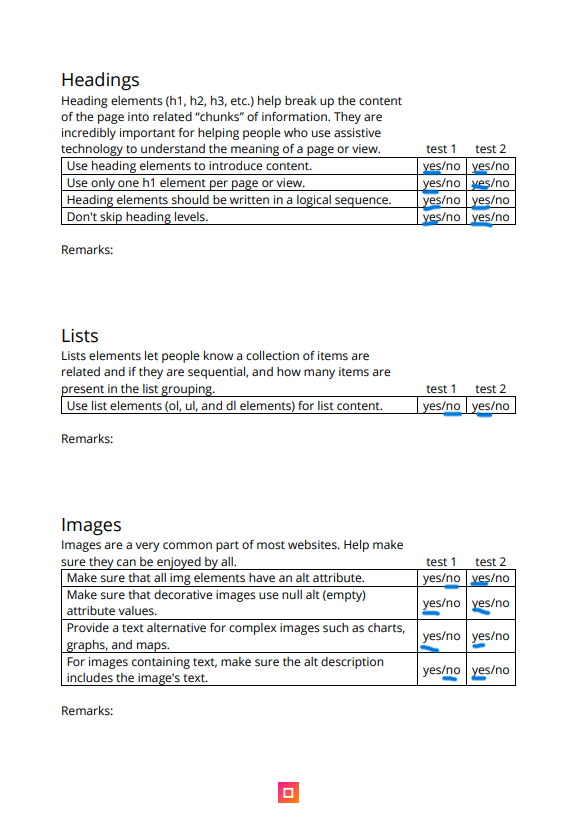

# Procesverslag
Markdown is een simpele manier om HTML te schrijven.  
Markdown cheat cheet: [Hulp bij het schrijven van Markdown](https://github.com/adam-p/markdown-here/wiki/Markdown-Cheatsheet).

Nb. De standaardstructuur en de spartaanse opmaak van de README.md zijn helemaal prima. Het gaat om de inhoud van je procesverslag. Besteedt de tijd voor pracht en praal aan je website.

Nb. Door *open* toe te voegen aan een *details* element kun je deze standaard open zetten. Fijn om dat steeds voor de relevante stuk(ken) te doen.

## Jij

  
uitwerken voor kick-off werkgroep

  ### Auteur:
  Calvin Sprengers

  #### Je startniveau:
  Blauw / Rood

  #### Je focus:
  Responsiveness

## Je website

  
uitwerken voor kick-off werkgroep

  ### Je opdracht:
  https://www.ajax.nl/

  #### Screenshot(s) van de eerste pagina (small screen): 
  Homepagina
  

  #### Screenshot(s) van de tweede pagina (small screen):
  hier de naam van de pagina  
  
 
 

## Toegankelijkheidstest 1/2 (week 1)

  
uitwerken na test in 2e werkgroep

  ### Bevindingen
  Lijst met je bevindingen die in de test naar voren kwamen:
  -Ajax maakt veel gebruik van div'jes in hun code. Dit zorgt voor verwarring binnen de screenreader / is niet semantisch correct.
  -Erg veel errors in de html validator. Geen alt bij images, alts niet tussen "", Geen headings etc.
  -Niet alle list content in ul/ol.
  -Geen dark mode
  -Geen contrast mode

  
  
  
  
  

## Breakdownschets (week 1)

  
uitwerken na afloop 3e werkgroep

 
  
 

## Voortgang 1 (week 2)

  
uitwerken voor 1e voortgang

  ### Stand van zaken
  -Begonnen met het schrijven van de code. In eerste instantie schreef ik in verkeerde dimensies. Het werd mij
    later pas duidelijk dat we moesten ontwerpen in het formaat van een Iphone SE. 
  
  -Header ging me gemakkelijk af. Simpele flexbox. Ziet er (bijna) hetzelfde uit als de echte site.
  
  -Alle HTML opgesteld. Nu is het tijd om vorm te geven.
  
  -Begonnen met section 2. Aangezien dit een flexbox is ging dit me makkelijk af. Het scrollbaar maken had ik iets meer
    moeite mee. Gelukkig had ik Wiebe (klasgenoot) die mij hiermee kon helpen. Ik begrijp het nu.
  
  -Begonnen met section 1. Grids snap ik niks van. 

  
  

  ### Agenda voor meeting
  samen met je groepje opstellen

  -Ik ga in het voortgangsgesprek vragen of iemand verstand heeft van grids. Hier heb ik hulp mee nodig, aangezien een
  groot deel van de Ajax website is opgesteld dmv grids.

  -Ook ga ik kijken hoe anderen ervoor staan en of ik op schema loop.

  ### Verslag van meeting
  hier na afloop snel de uitkomsten van de meeting vastleggen

  -Goed op weg
  -Pas de grootte van de header aan
  -Volgende week aan de slag met grids
  -Vergeet geen H1 toe te voegen aan de code. Zet deze op display:none zodat hij wel gelezen wordt door screenreaders maar niet zichtbaar is.

## Voortgang 2 (week 3)

  
uitwerken voor 2e voortgang

  ### Stand van zaken
  -Eerste les voornamelijk aan de slag geweest met het positioneren van mijn eerste section. Ik heb nog steeds moeite met het opstellen van grids. Na lang proberen
    is het eindelijk gelukt om de eerste <a> goed te positioneren. Zie afbeelding onder deze paragraaf.
  -2e HTML pagina aangemaakt, de code geschreven. Geprobeerd om stylesheet te koppelen, maar dit ging mis aangezien deze alle geschreven css van de eerste pagina overneemt.
    Ik heb besloten om een tweede css pagina aan te maken en deze te koppelen aan paginatwee.html.
  -Begonnen met werken aan de artikelen (section 4). Doordat ik grids nu redelijk begrijp was het simpel om deze op te stellen. Dit ging zonder moeite. (Zie afbeelding.)
  -Section 2 van paginatwee vormgegeven. Dit was vrij simpel. Code geinspireerd op section 2 van index. Ik heb gelijk javascript toegevoegd. Met wat hulp van Wiebe heb ik
    deze aan de praat gekregen. Ik snap zelf namelijk weinig van Javascript. Zie afbeelding voor de code.
  -Footer vormgegeven dmv flexbox. Vrij simpel.
  -Section 1 van paginatwee en section 5 van index zijn vrijwel hetzelfde. Ik snap niet hoe dit werkt. Hier zal ik in de voortgangsgesprekken (of aan docent / studentassistent) naar vragen.
  -Section 3 en 6 toegevoegd aan index. Dit zijn vrijwel kopieeen van andere sections. Het enige wat ik moest doen was de formaten van de grids aanpassen.

   in mijn eerste section.">
  
  

  ### Agenda voor meeting
  samen met je groepje opstellen

  -Vragen of iemand verstand heeft van javascript. Ik heb een hamburger menu overlay nodig. Ik begrijp niet hoe dit werkt.
  -Kijken of ik op schema loop.
  -Vragen naar hulp bij het positioneren van section 1 van paginatwee.
  -Info vragen over responsive maken van site.

  ### Verslag van meeting
  hier na afloop snel de uitkomsten van de meeting vastleggen
  - Ik loop aardig op schema.
  - Andere studenten wisten ook niet hoe ze de grid van section1 paginatwee vorm moesten geven. Ik zal het aan een studentassistent of de docent vragen.
  - Jesse heeft mij zijn code laten zien. Hij heeft ook een hamburger menu. Ik zal deze code gebruiken ter inspiratie voor de mijne.

## Toegankelijkheidstest 2/2 (week 4)

  
uitwerken na test in 9e werkgroep

  ### Bevindingen
  Lijst met je bevindingen die in de test naar voren kwamen (geef ook aan wat er verbeterd is):
  -Nog geen h1
  -Nog niet bij alle imgs een alt tag (gelijk toegevoegd)
  -Geen focus states (gelijk toegevoegd)
  -Geen hover states (gelijk toegevoegd)
  
  
  
  
  
  

## Voortgang 3 (week 4)

  
uitwerken voor 3e voortgang

  ### Stand van zaken
 -Na lang klooien is het (Finn en) mij gelukt om de eerste section van paginatwee goed te positioneren. Zie onderstaande afbeeldingen voor 
  de code en het eindresultaat. Ik heb deze code ook in index op de correcte plek toegevoegd (section 5)
 -2e nav toegevoegd aan de header. Dmv "@media screen and" laat ik deze zien bij een minimale schermbreedte van 770px ipv de mobiele nav.
 -Erachter gekomen dat ik te veel met px gewerkt heb tijdens het creeeren van grids. Als ik dit probeer aan te passen gaat alles mis. 
  Ik heb de font-size aangepast naar 10px zodat 1 rem 10 px is. Ik hoop zo alles om te kunnen rekenen en het responsive te maken. Ik ga mij echter eerst focussen op 
  de breakpoints met media queries.
 -Media query toegevoegd aan section 1 en 4 van index. Wanneer het scherm groter wordt dan 770px gaan deze nu naast elkaar staan ipv onder elkaar. (lastiger dan gedacht :p).
  Ik heb er bewust voor gekozen om geen 3e <a> bij section 1 toe te voegen bij een schermbreedte van 770px, wat wel bij ajax gebeurt. De docent heeft aangegeven dit een rare
  toevoeging te vinden aan websites. (Extra content bij een andere schermbreedte.)
 -

  ### Agenda voor meeting
  samen met je groepje opstellen
  
  -Vragen hoe ik mijn grids responsive krijg. 
  -Vragen hoe ik een margin op section 2 van index krijg, zodat de video's niet van het scherm af scrollen maar er wit(zwart)ruimte op de zijdes van het scherm blijft
  wanneer het scherm breder wordt.

  ### Verslag van meeting
  hier na afloop snel de uitkomsten van de meeting vastleggen

  -Helaas was ik ziek op de dag van de laatste voortganggesprekken. Ik ga op internet op zoek naar antwoorden op mijn vragen.

## Eindgesprek (week 5)

  
uitwerken voor eindgesprek

  ### Je uitkomst - karakteristiek screenshots:
  

  ### Dit ging goed/Heb ik geleerd: 
  Korte omschrijving met plaatjes
  -Voor dit vak had ik heel weinig verstand van html / css. Ik heb er 1 keer eerder mee gewerkt (tijdens internetstandaarden). Hier vond ik het al een hele uitdaging om een zeer simpele     pagina in elkaar te zetten. Ik heb mijn algemene kennis over webcoderen een flinke stap omhoog geholpen met dit vak.
  -Ik wist niks over grids. Nu heb ik hier aardig wat verstand van, ondanks dat ik nog wat moeite heb met ze responsive maken. Ik weet hoe ik een grid opstel en hoe ik items binnen de grid op de juiste plek positioneer.
  -Voor dit vak wist ik niks over media queries. Ik heb geleerd hoe ik breakpoints toevoeg bij een minimum / maximum schermbreedte. Ik weet hoe ik een site tot op een bepaald niveau responsive maak. Hier ben ik trots op.
  -Ik weet om te gaan met selectors. Ik heb zeer weinig gebruik gemaakt van classes en id's.
  -Ik weet hoe ik semantisch code opstel, zonder teveel gebruik van div's, spans etc.
  -Ik heb de basis van javascript meegekregen, aangezien ik het vak inleiding programmeren nooit gedaan heb
  

  

  ### Dit was lastig/Is niet gelukt:
  
  -Helaas begon ik iets te laat met het responsive maken van mijn website. Hierdoor heb ik weinig / geen hulp hierbij kunnen krijgen. Ik heb lang geprobeerd mijn px gebaseerde grids
    om te zetten naar responsive % grids. Wanneer ik dit probeerde ging alles mis. Ik heb daarom gefocust op de breakpoints / media queries, omdat ik dit belangrijker vond. Hierdoor is mijn
    site niet responsive op de manier waarop ik dat wilde. Desondanks ben ik toch verder gekomen dan ik dacht (zie 1e afbeelding).
  -Ik heb het, ondanks de vele voorbeelden die ik had, niet voor elkaar gekregen om mijn hamburger menu werkend te krijgen. Elke keer dat ik het menu toevoegde ging er wel wat mis met mijn site. Vandaar heb ik besloten hem er voor nu uit te laten. Als ik een week extra de tijd had gehad, weet ik zeker dat dit mij was gelukt. 
  -Bij paginatwee, section 2 verspringen op de werkelijke Ajax site de li's naar twee naast elkaar / drie naast elkaar bij bepaalde breakpoints. Ik had al erg veel moeite met de javascript code schrijven
    om de buttons werkend te krijgen. Dit was voor mij helaas iets te geavanceerd om nog binnen de tijd uit te werken (zie afbeelding 2).

  
  

## Bronnenlijst

  
continu bijhouden terwijl je werkt

  Nb. Wees specifiek ('css-tricks' als bron is bijv. niet specifiek genoeg). 
  Nb. ChatGpT en andere AI horen er ook bij.
  Nb. Vermeld de bronnen ook in je code.

  1. https://chat.openai.com/
  2. https://cssgrid-generator.netlify.app/
  3. https://css-tricks.com/snippets/css/complete-guide-grid/#aa-grid-properties
  4. https://www.semrush.com/blog/semantic-html5-guide/
  5. https://www.w3schools.com/css/css3_flexbox.asp
  6. https://flexboxfroggy.com/
  7. https://www.w3schools.com/js/js_const.asp
  8. https://www.youtube.com/watch?v=OFKBep95lb4
  9. https://stackoverflow.com/questions/42472132/how-to-make-four-viewport-based-boxes-with-flexbox
  10. https://stackoverflow.com/questions/10972096/unordered-list-not-aligning-all-the-way-to-the-left-in-a-div
  11. https://www.aleksandrhovhannisyan.com/blog/62-5-percent-font-size-trick/

